# Development Workflow Guide

This guide explains how to safely develop and test database migrations in this project.

## 🚀 Quick Start

1. **Setup local environment**:
   ```bash
   # Copy environment template
   cp env.template .env.local

   # Edit .env.local with your database URLs
   # Get these from Vercel dashboard -> Storage
   ```

2. **Sync preview database to local**:
   ```bash
   pnpm db:sync preview
   ```

3. **Start development**:
   ```bash
   pnpm dev
   ```

## 🗄️ Database Workflow

### Environment Setup

We use three database environments:

- **Production** (`PRODUCTION_POSTGRES_URL`) - Live data, handle with care
- **Preview** (`PREVIEW_POSTGRES_URL`) - Vercel preview deployments
- **Local** (`POSTGRES_URL`) - Your local development database

### Database Sync Commands

```bash
# Sync preview database to local (recommended)
pnpm db:sync preview

# Sync production database to local (use sparingly)
pnpm db:sync production

# Fresh development start with latest preview data
pnpm dev:fresh
```

## 🔄 Migration Workflow

### The Safe Development Process

```mermaid
graph TB
    A["1. Sync Preview → Local"] --> B["2. Make PayloadCMS Changes"]
    B --> C["3. Generate Migration"]
    C --> D["4. Test Migration Locally"]
    D --> E["5. Create PR"]
    E --> F["6. Test on Preview"]
    F --> G["7. Merge to Production"]

    style A fill:#e1f5fe
    style D fill:#fff3e0
    style F fill:#fff3e0
    style G fill:#e8f5e8
```



### Step-by-Step Guide

#### 1. **Sync Latest Data**
```bash
# Get latest preview data
pnpm db:sync preview
```

#### 2. **Make Changes in PayloadCMS**
- Modify collections in `src/collections/`
- Update `src/payload.config.ts`
- Add/remove fields, change localization, etc.

#### 3. **Generate Migration**
```bash
# PayloadCMS will detect schema changes and generate migration
pnpm migrate:create
```

#### 4. **Test Migration Locally**
```bash
# Test with backup/restore safety
pnpm migrate:test

# Or simple test (no backup)
pnpm migrate:test:simple
```

#### 5. **Create Pull Request**
- Commit your changes including the new migration file
- Create PR - GitHub will automatically detect migrations
- Review the migration code carefully

#### 6. **Test on Preview**
- Merge PR to trigger preview deployment
- Check preview environment logs for migration success
- Test preview app functionality

#### 7. **Deploy to Production**
- If preview tests pass, merge to `main`
- Production deployment will run migrations automatically

## 🧪 Testing Commands

```bash
# Check migration status
pnpm migrate:status

# Run migrations manually
pnpm migrate:run

# Test migration with backup/restore
pnpm migrate:test

# Check if using local database
pnpm db:sync:check
```

## 🛠️ Available Scripts

### Database Scripts
- `pnpm db:sync [preview|production]` - Sync remote database to local
- `pnpm db:sync:preview` - Sync preview to local
- `pnpm db:sync:production` - Sync production to local (careful!)
- `pnpm db:sync:check` - Check if using local database

### Migration Scripts
- `pnpm migrate:create` - Generate new migration
- `pnpm migrate:run` - Run pending migrations
- `pnpm migrate:status` - Show migration status
- `pnpm migrate:test` - Test migrations with backup/restore
- `pnpm migrate:test:simple` - Simple migration test

### Development Scripts
- `pnpm dev` - Start development server (checks local DB first)
- `pnpm dev:fresh` - Sync preview data + start development

## 🔒 Safety Features

### Automatic Checks
- `pnpm dev` checks if you're using local database
- GitHub Actions validate migration syntax
- Migration testing includes automatic backup/restore

### Migration Safety
- All migrations are idempotent (can run multiple times safely)
- Local testing with backup/restore prevents data loss
- Preview environment testing before production

### Best Practices
- Always test migrations locally first
- Use preview environment for final validation
- Never edit migration files after creation
- Keep migrations small and focused

## 🚨 Troubleshooting

### Database Connection Issues
```bash
# Check if PostgreSQL is running
brew services list | grep postgresql

# Start PostgreSQL if needed
brew services start postgresql

# Test connection
psql "$POSTGRES_URL" -c "SELECT 1;"
```

### Migration Failures
```bash
# Check what migrations are pending
pnpm migrate:status

# If stuck, restore from backup and try again
# (the migrate:test script does this automatically)
```

### Environment Variables Missing
```bash
# Check required variables
echo $POSTGRES_URL
echo $PREVIEW_POSTGRES_URL
echo $PAYLOAD_SECRET
```

Required in `.env.local`:
- `POSTGRES_URL` - Local PostgreSQL connection
- `PREVIEW_POSTGRES_URL` - Vercel preview database
- `PAYLOAD_SECRET` - PayloadCMS secret key
- `BLOB_READ_WRITE_TOKEN` - Vercel blob storage token

## 🎯 Migration Examples

### Adding a New Field
```typescript
// 1. Update collection
export const MyCollection: CollectionConfig = {
  fields: [
    // existing fields...
    {
      name: 'newField',
      type: 'text',
      required: true,
      localized: true, // if using localization
    }
  ]
}

// 2. Generate migration
// pnpm migrate:create

// 3. Migration will handle:
// - Adding column to main table
// - Adding localized columns if needed
// - Setting default values for existing records
```

### Enabling Localization
```typescript
// 1. Update payload.config.ts
export default buildConfig({
  localization: {
    locales: [
      { code: 'en', label: 'English' },
      { code: 'uk', label: 'Ukrainian' }
    ],
    defaultLocale: 'en'
  }
})

// 2. Update collections with localized fields
// 3. Generate migration - it will create locale tables
```

This workflow ensures your migrations are thoroughly tested before reaching production! 🎉
